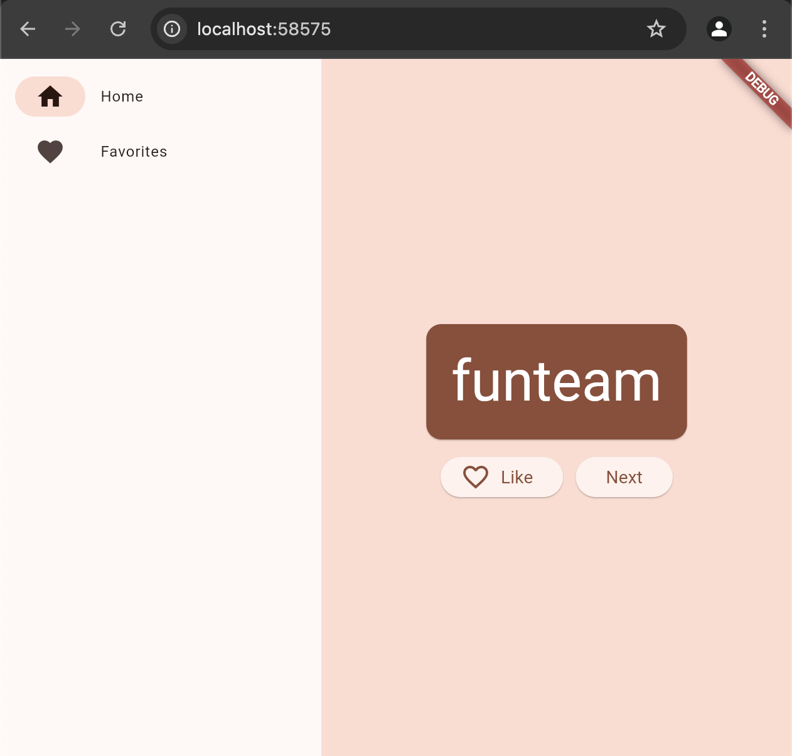

# namer_app

It's been awhile since I've touched flutter, and I'm brand new to Flutter Web. Followed the tutorial available on [Google Codelabs](https://codelabs.developers.google.com/codelabs/flutter-codelab-first). Excited to code once and build on all platforms (iOS, Android, Web, Desktop)

Screenshot:

## How to run
1. In VS Code you can click debug, and a chrome window should pop up.
2. In terminal, type `flutter run -d chrome`, then chrome should pop open `http://localhost:55802/`. I've noticed it hangs sometimes, so just refresh, and it should be fine.

Note: if #2 approach taken, hot reload is not applied, so you must press 'r' in terminal for browser changes to take effect.

## Getting Started

This project is a starting point for a Flutter application.

A few resources to get you started if this is your first Flutter project:

- [Lab: Write your first Flutter app](https://docs.flutter.dev/get-started/codelab)
- [Cookbook: Useful Flutter samples](https://docs.flutter.dev/cookbook)

For help getting started with Flutter development, view the
[online documentation](https://docs.flutter.dev/), which offers tutorials,
samples, guidance on mobile development, and a full API reference.
